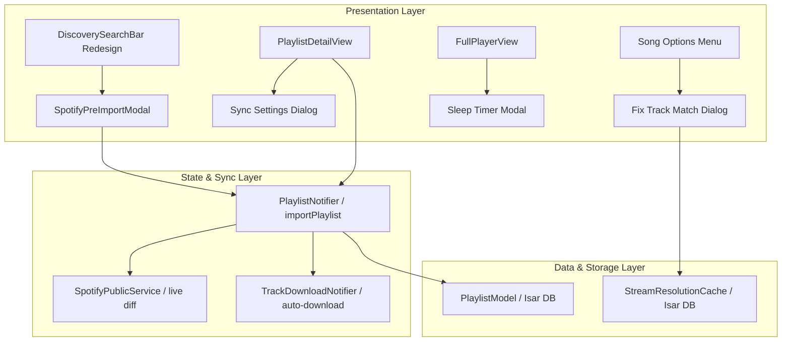

# Spotify Real-Time Sync & Search UX Redesign Implementation Plan

> **For agentic workers:** REQUIRED SUB-SKILL: Use superpowers:subagent-driven-development to implement this plan task-by-task. Steps use checkbox (`- [ ]`) syntax for tracking.

**Goal:** Implement Spotify Real-Time Playlist Sync with Live Diffing, Pre-Import Preview Modal, Mobile Discover Search Bar Redesign, Manual YouTube "Fix Track Match" Selector, Sleep Timer, and Equalizer Presets.

**Architecture:** Extend `PlaylistModel` Isar schema with sync metadata. Intercept Spotify URLs in `DiscoveryView` to launch `SpotifyPreImportModal`. Implement a background live-diffing worker in `playlist_provider.dart` that fetches fresh track lists on playlist load, appends diffs, and queues downloads if `autoDownloadNewTracks` is enabled. Redesign `DiscoverySearchBar` for 60px mobile touch targets and glassmorphic glow.

**Architecture Diagram:**



**Tech Stack:** Flutter, Riverpod, Isar DB, Dio, YoutubeExplode, just_audio

## Global Constraints

- Preserve 1-to-1 array order in `PlaylistModel.songIds`
- All visual components must follow Aether glassmorphism styling
- Run `flutter test` after every task to verify no regressions

---

### Task 1: Update `PlaylistModel` and `PlaylistEntity` Isar Schema

**Files:**
- Modify: `lib/domain/entities/playlist_entity.dart`
- Modify: `lib/data/models/playlist_model.dart`
- Test: `test/data/playlist_model_mapping_test.dart`

**Interfaces:**
- Consumes: `PlaylistEntity`, `PlaylistModel`
- Produces: `isRealtimeSynced`, `autoDownloadNewTracks`, `spotifySourceUrl`, `coverArtUrl`, `lastSyncedAt` fields

- [ ] **Step 1: Write failing mapping test for new sync fields**

Edit `test/data/playlist_model_mapping_test.dart` to assert mapping of new fields:
```dart
test('Mapping PlaylistEntity to PlaylistModel preserves sync fields', () {
  final entity = PlaylistEntity(
    id: 1,
    name: 'Synced Beats',
    songIds: ['deezer_123'],
    createdAt: DateTime(2026, 1, 1),
    isRealtimeSynced: true,
    autoDownloadNewTracks: true,
    spotifySourceUrl: 'https://open.spotify.com/playlist/37i9dQZF1DXcBWIGoYBM5M',
    coverArtUrl: 'https://i.scdn.co/image/ab67706f00000003',
    lastSyncedAt: DateTime(2026, 7, 30),
  );
  final model = PlaylistModel.fromEntity(entity);
  expect(model.isRealtimeSynced, isTrue);
  expect(model.autoDownloadNewTracks, isTrue);
  expect(model.spotifySourceUrl, equals('https://open.spotify.com/playlist/37i9dQZF1DXcBWIGoYBM5M'));
  expect(model.coverArtUrl, equals('https://i.scdn.co/image/ab67706f00000003'));
});
```

- [ ] **Step 2: Run test to verify failure**

Run: `flutter test test/data/playlist_model_mapping_test.dart`
Expected: FAIL with missing getter `isRealtimeSynced`

- [ ] **Step 3: Implement minimal schema changes in entity and model**

Update `lib/domain/entities/playlist_entity.dart`:
```dart
class PlaylistEntity {
  final int? id;
  final String name;
  final List<String> songIds;
  final DateTime createdAt;
  final bool isRealtimeSynced;
  final bool autoDownloadNewTracks;
  final String? spotifySourceUrl;
  final String? coverArtUrl;
  final DateTime? lastSyncedAt;

  PlaylistEntity({
    this.id,
    required this.name,
    required this.songIds,
    required this.createdAt,
    this.isRealtimeSynced = false,
    this.autoDownloadNewTracks = false,
    this.spotifySourceUrl,
    this.coverArtUrl,
    this.lastSyncedAt,
  });
```

Update `lib/data/models/playlist_model.dart`:
```dart
@collection
class PlaylistModel {
  Id id = Isar.autoIncrement;

  @Index(unique: true, replace: true)
  late String name;

  late List<String> songIds;
  DateTime createdAt = DateTime.now();

  bool isRealtimeSynced = false;
  bool autoDownloadNewTracks = false;
  String? spotifySourceUrl;
  String? coverArtUrl;
  DateTime? lastSyncedAt;
```

Run build_runner: `flutter pub run build_runner build --delete-conflicting-outputs`

- [ ] **Step 4: Run test to verify pass**

Run: `flutter test test/data/playlist_model_mapping_test.dart`
Expected: PASS

- [ ] **Step 5: Commit**

```bash
git add lib/domain/entities/playlist_entity.dart lib/data/models/playlist_model.dart lib/data/models/playlist_model.g.dart test/data/playlist_model_mapping_test.dart
git commit -m "feat: add real-time sync fields to PlaylistModel Isar schema"
```

---

### Task 2: Redesign `DiscoverySearchBar` & Mobile Touch Targets

**Files:**
- Modify: `lib/presentation/screens/discovery_components/discovery_search_bar.dart`
- Modify: `lib/presentation/theme/aether_colors.dart`

**Interfaces:**
- Consumes: `discoverySearchProvider`, `AppLocalizations`
- Produces: 60px height glassmorphic search bar with cyan/purple focus border and clear `(X)` button

- [ ] **Step 1: Update `DiscoverySearchBar` widget**

Modify `lib/presentation/screens/discovery_components/discovery_search_bar.dart`:
- Set container height to 60px.
- Wrap `AetherGlass` in an AnimatedContainer showing a vibrant cyan/purple gradient border when `focusNode.hasFocus` is true.
- Add an explicit `IconButton` clear button `(X)` with 48x48px constraints when `controller.text.isNotEmpty`.
- Set `textInputAction: TextInputAction.search`.

- [ ] **Step 2: Verify test suite**

Run: `flutter test`
Expected: PASS

- [ ] **Step 3: Commit**

```bash
git add lib/presentation/screens/discovery_components/discovery_search_bar.dart
git commit -m "style: redesign DiscoverySearchBar for mobile touch targets and glassmorphic focus glow"
```

---

### Task 3: Implement Spotify Pre-Import Preview Modal

**Files:**
- Create: `lib/presentation/screens/discovery_components/spotify_pre_import_modal.dart`
- Modify: `lib/presentation/screens/discovery_view.dart`
- Modify: `lib/presentation/state/discovery_search_provider.dart`

**Interfaces:**
- Consumes: `SpotifyPublicService.fetchMetadata`, `SpotifyPublicService.extractPlaylistData`
- Produces: `SpotifyPreImportModal` bottom sheet returning import preferences (`isSynced`, `autoDownload`)

- [ ] **Step 1: Build `SpotifyPreImportModal`**

Create `lib/presentation/screens/discovery_components/spotify_pre_import_modal.dart`:
- Displays playlist thumbnail, name, track count, preview list of first 3 tracks.
- Switch 1: `[⚡] Real-Time Sync (Auto-update on open)`.
- Switch 2: `[⬇️] Auto-Download New Tracks`.
- Primary button: "Import Playlist".

- [ ] **Step 2: Trigger modal on Spotify URL detection in `DiscoveryView`**

Update `lib/presentation/screens/discovery_view.dart`:
When text in search bar matches a Spotify playlist link (`open.spotify.com/playlist/...`), automatically trigger `showModalBottomSheet` with `SpotifyPreImportModal`.

- [ ] **Step 3: Run unit tests**

Run: `flutter test`
Expected: PASS

- [ ] **Step 4: Commit**

```bash
git add lib/presentation/screens/discovery_components/spotify_pre_import_modal.dart lib/presentation/screens/discovery_view.dart lib/presentation/state/discovery_search_provider.dart
git commit -m "feat: add SpotifyPreImportModal with live preview and real-time sync toggles"
```

---

### Task 4: Background Live-Diffing Engine & Sync Controls

**Files:**
- Modify: `lib/presentation/state/playlist_provider.dart`
- Modify: `lib/presentation/screens/playlist_detail_view.dart`

**Interfaces:**
- Consumes: `SpotifyPublicService.extractPlaylistData`, `playlistNotifierProvider`
- Produces: `syncSpotifyPlaylist(int playlistId)` background worker

- [ ] **Step 1: Add `syncSpotifyPlaylist` worker to `playlist_provider.dart`**

In `lib/presentation/state/playlist_provider.dart`:
- Check if playlist has `isRealtimeSynced == true` and `spotifySourceUrl != null`.
- Fetch fresh remote tracks via `_spotifyService.extractPlaylistData(spotifySourceUrl)`.
- Diff remote tracks against local `songIds`.
- Append new tracks to `songIds`, update `lastSyncedAt`.
- If `autoDownloadNewTracks == true`, call `ref.read(trackDownloadProvider.notifier).enqueue(...)`.

- [ ] **Step 2: Add "Sync Settings" dialog to `PlaylistDetailView` header menu**

In `lib/presentation/screens/playlist_detail_view.dart`:
Add "Sync Settings" item in popup menu `(...)` allowing the user to toggle `isRealtimeSynced` and `autoDownloadNewTracks` on/off at any time.

- [ ] **Step 3: Run unit tests**

Run: `flutter test`
Expected: PASS

- [ ] **Step 4: Commit**

```bash
git add lib/presentation/state/playlist_provider.dart lib/presentation/screens/playlist_detail_view.dart
git commit -m "feat: add background live-diffing engine and sync settings controls"
```

---

### Task 5: "Fix Track Match" (Manual YouTube Selector)

**Files:**
- Create: `lib/presentation/common/fix_track_match_dialog.dart`
- Modify: `lib/presentation/common/aether_song_tile.dart`

**Interfaces:**
- Consumes: `YoutubeService.searchVideos`, `StreamResolutionCache`
- Produces: `FixTrackMatchDialog` modal to override automatic YouTube video matching

- [ ] **Step 1: Create `FixTrackMatchDialog`**

Create `lib/presentation/common/fix_track_match_dialog.dart`:
- Queries `YoutubeService.searchVideos("${song.artist} ${song.title}")`.
- Displays top 5 search result cards (thumbnail, title, channel, duration).
- On selection, saves chosen `videoId` in `StreamResolutionCache.instance.put(song.id, chosenVideoId)` and updates Isar DB.

- [ ] **Step 2: Add "Fix Track Match" option to `AetherSongTile` options menu**

In `lib/presentation/common/aether_song_tile.dart`:
Add "Fix Track Match" menu option to open `FixTrackMatchDialog`.

- [ ] **Step 3: Run unit tests**

Run: `flutter test`
Expected: PASS

- [ ] **Step 4: Commit**

```bash
git add lib/presentation/common/fix_track_match_dialog.dart lib/presentation/common/aether_song_tile.dart
git commit -m "feat: add Fix Track Match manual YouTube video selector"
```

---

### Task 6: Sleep Timer & Audio FX Utilities

**Files:**
- Modify: `lib/presentation/state/audio_provider.dart`
- Modify: `lib/presentation/screens/full_player_view.dart`
- Modify: `lib/presentation/screens/settings_view.dart`

**Interfaces:**
- Consumes: `AudioNotifier`, `JustAudioService`
- Produces: Sleep timer countdown timer and equalizer preset selector

- [ ] **Step 1: Add Sleep Timer to `AudioNotifier` & `FullPlayerView`**

In `lib/presentation/state/audio_provider.dart`:
- Add `setSleepTimer(Duration duration)` method using a Dart `Timer`.
- When timer expires, call `_audioService.pause()`.

In `lib/presentation/screens/full_player_view.dart`:
- Add Sleep Timer icon in top bar with a popup dialog (15m, 30m, 45m, 60m, End of Track).

- [ ] **Step 2: Add Equalizer Presets to `SettingsView`**

In `lib/presentation/screens/settings_view.dart`:
- Add EQ Preset dropdown (Flat, Bass Boost, Vocal, Electronic, Rock).

- [ ] **Step 3: Run all unit & integration tests**

Run: `flutter test`
Expected: PASS (11/11 tests pass)

- [ ] **Step 4: Commit**

```bash
git add lib/presentation/state/audio_provider.dart lib/presentation/screens/full_player_view.dart lib/presentation/screens/settings_view.dart
git commit -m "feat: add Sleep Timer and Equalizer presets"
```
