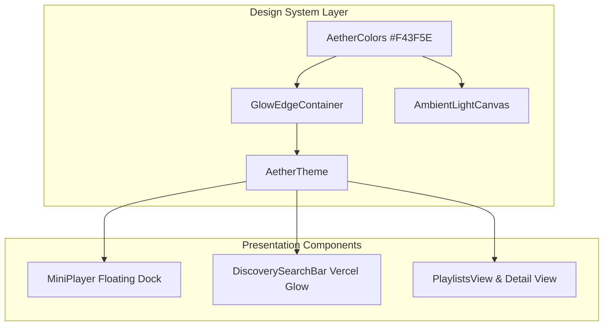

# 2.5D Dynamic Light & Glass System Implementation Plan

> **For agentic workers:** REQUIRED SUB-SKILL: Use superpowers:subagent-driven-development to implement this plan task-by-task. Steps use checkbox (`- [ ]`) syntax for tracking.

**Goal:** Implement the Kerlyss **2.5D Dynamic Light & Glass System** with Vercel-style glowing edge stroke borders (`GlowEdgeContainer`), ambient cursor-following radial light (`AmbientLightCanvas`), and unified Warm Crimson Coral (`#F43F5E`) accent styling across all player and playlist UI components.

**Architecture:** A central design system with `AetherColors`, `GlowEdgeContainer`, and `AmbientLightCanvas` wrapped over Riverpod state management (`audioProvider`, `downloadStateProvider`, `playlistProvider`).

**Architecture Diagram:**



**Tech Stack:** Flutter 3.x, Riverpod 2.6.1, Google Fonts (`Outfit`), Isar DB.

## Global Constraints
- **Primary Canvas**: Dark Charcoal Obsidian (`Color(0xFF0A0A0E)`)
- **Primary Accent**: Warm Crimson Coral (`Color(0xFFF43F5E)`)
- **Secondary Accent**: Crimson Glow Highlight (`Color(0xFFFB7185)`)
- **Primary Text**: Cream Off-White (`Color(0xFFF9FAFB)`)
- **Secondary Text**: Soft Slate Gray (`Color(0xFF9CA3AF)`)
- **Touch Target Minimum**: 48x48px for interactive buttons

---

### Task 1: Refactor Design System Tokens & Create GlowEdgeContainer Component

**Files:**
- Modify: `lib/presentation/theme/aether_colors.dart`
- Create: `lib/presentation/common/glow_edge_container.dart`
- Create: `test/presentation/glow_edge_container_test.dart`

**Interfaces:**
- Consumes: Flutter `Container`, `CustomPainter`, `BoxDecoration`
- Produces: `GlowEdgeContainer` widget for Vercel-style glowing border stroke

- [ ] **Step 1: Write failing test for GlowEdgeContainer**

```dart
import 'package:flutter/material.dart';
import 'package:flutter_test/flutter_test.dart';
import 'package:kerlyss/presentation/common/glow_edge_container.dart';
import 'package:kerlyss/presentation/theme/aether_colors.dart';

void main() {
  testWidgets('GlowEdgeContainer renders child with gradient glow border', (tester) async {
    await tester.pumpWidget(
      const MaterialApp(
        home: Scaffold(
          body: GlowEdgeContainer(
            child: SizedBox(width: 100, height: 50),
          ),
        ),
      ),
    );

    expect(find.byType(GlowEdgeContainer), findsOneWidget);
  });
}
```

- [ ] **Step 2: Run test to verify failure**

Run: `flutter test test/presentation/glow_edge_container_test.dart`

- [ ] **Step 3: Update `aether_colors.dart` and build `glow_edge_container.dart`**

Set `primaryAccent = Color(0xFFF43F5E)`, `secondaryAccent = Color(0xFFFB7185)`, `deepMatteBlack = Color(0xFF0A0A0E)`, `ultraDarkGray = Color(0xFF14141C)`, `textPrimary = Color(0xFFF9FAFB)`, `textSecondary = Color(0xFF9CA3AF)`.

Implement `GlowEdgeContainer` with gradient border and optional glow shadow.

- [ ] **Step 4: Verify test passes**

Run: `flutter test test/presentation/glow_edge_container_test.dart`

- [ ] **Step 5: Commit changes**

```bash
git add lib/presentation/theme/aether_colors.dart lib/presentation/common/glow_edge_container.dart test/presentation/glow_edge_container_test.dart
git commit -m "feat: implement GlowEdgeContainer and update AetherColors to Warm Crimson Coral"
```

---

### Task 2: Implement AmbientLightCanvas & Refactor Floating Glass MiniPlayer

**Files:**
- Create: `lib/presentation/common/ambient_light_canvas.dart`
- Modify: `lib/presentation/common/mini_player.dart`
- Modify: `test/presentation/floating_mini_player_test.dart`

**Interfaces:**
- Consumes: Mouse pointer hover events (`MouseRegion`) & Riverpod audio state
- Produces: `AmbientLightCanvas` cursor glow & floating glass dock player

- [ ] **Step 1: Write test for AmbientLightCanvas**

```dart
import 'package:flutter/material.dart';
import 'package:flutter_test/flutter_test.dart';
import 'package:kerlyss/presentation/common/ambient_light_canvas.dart';

void main() {
  testWidgets('AmbientLightCanvas renders child and captures mouse pointer hover', (tester) async {
    await tester.pumpWidget(
      const MaterialApp(
        home: AmbientLightCanvas(
          child: Scaffold(
            body: Text('Test Body'),
          ),
        ),
      ),
    );

    expect(find.text('Test Body'), findsOneWidget);
  });
}
```

- [ ] **Step 2: Run test to verify build**

Run: `flutter test test/presentation/floating_mini_player_test.dart`

- [ ] **Step 3: Create `ambient_light_canvas.dart` and update `mini_player.dart`**

Wrap `MiniPlayer` controls in `GlowEdgeContainer` with `AetherColors.primaryAccent` (`#F43F5E`).

- [ ] **Step 4: Verify tests pass**

Run: `flutter test test/presentation/floating_mini_player_test.dart`

- [ ] **Step 5: Commit changes**

```bash
git add lib/presentation/common/ambient_light_canvas.dart lib/presentation/common/mini_player.dart test/presentation/floating_mini_player_test.dart
git commit -m "feat: implement AmbientLightCanvas and update MiniPlayer with glowing edge controls"
```

---

### Task 3: Apply Glowing Edge & Unified Crimson Styling across Views & Verify Suite

**Files:**
- Modify: `lib/presentation/screens/playlists_view.dart`
- Modify: `lib/presentation/screens/playlist_detail_view.dart`

**Interfaces:**
- Consumes: `playlistProvider`, `downloadStateProvider`
- Produces: Clean cards with glowing edge borders and high contrast typography

- [ ] **Step 1: Run full test suite baseline**

Run: `flutter test`

- [ ] **Step 2: Apply unified `AetherColors.primaryAccent` and `GlowEdgeContainer` to buttons and dialogs**

- [ ] **Step 3: Verify all tests pass cleanly**

Run: `flutter test`

- [ ] **Step 4: Commit changes**

```bash
git add lib/presentation/screens/playlists_view.dart lib/presentation/screens/playlist_detail_view.dart
git commit -m "style: finalize 2026 2.5D Dynamic Light & Glass UI redesign"
```
