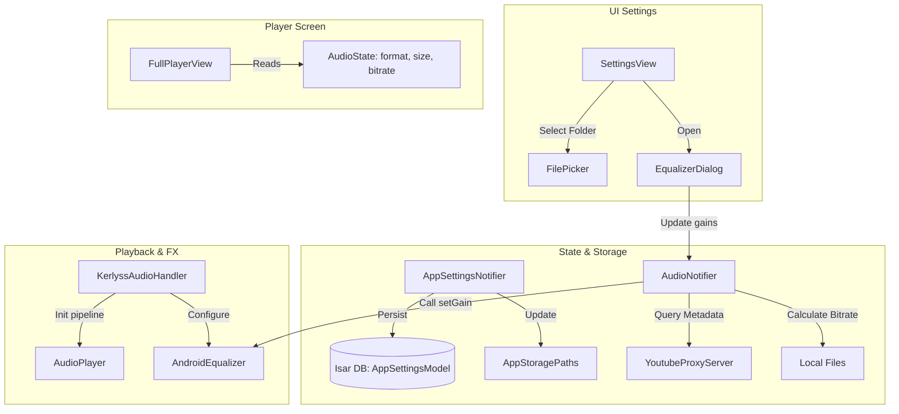

# UX & Feature Improvements Implementation Plan

> **For agentic workers:** REQUIRED SUB-SKILL: Use superpowers:subagent-driven-development to implement this plan task-by-task. Steps use checkbox (`- [ ]`) syntax for tracking.

**Goal:** Improve Android version usability and satisfy reviewer complaints by implementing persistent settings, folder picker, 5-band equalizer, responsive player layout, and an audio info panel.

**Architecture:**
- Create `AppSettingsModel` (Isar collection) to persist configuration across launches.
- Dynamic path resolution: update `AppStoragePaths` to hold a static reference `_customDownloadsPath` that overrides default directory paths.
- Audio pipeline: wire `AndroidEqualizer` into the `AudioPipeline` inside `KerlyssAudioHandler` on Android.
- State-driven metadata: calculate/load audio properties in `AudioNotifier` when the song changes and expose it in `AudioState`.
- Responsive layout: update `FullPlayerView` to use layout constraints and flex spacing to adapt beautifully to tall screens.

**Architecture Diagram:**



**Tech Stack:**
- Flutter SDK (>=3.3.0)
- `file_picker: ^8.1.4` (new)
- `isar` / `isar_flutter_libs`
- `just_audio` (audio effects pipeline)
- `flutter_riverpod`

## Global Constraints
- Target platform target: Android (Equalizer), Cross-Platform (Folder Picker, Layout, Info Panel)
- Band Gains range: -15.0 dB to 15.0 dB
- Equalizer bands: 5 bands (60Hz, 230Hz, 910Hz, 4kHz, 14kHz)

---

### Task 1: Add `file_picker` & Create Isar Schema `AppSettingsModel`

**Files:**
- Modify: `pubspec.yaml`
- Create: `lib/data/models/app_settings_model.dart`
- Modify: `lib/data/datasources/local/isar_database_service.dart`

**Interfaces:**
- Produces: `AppSettingsModel` class & Isar collection operations.

- [ ] **Step 1: Add `file_picker` to dependencies**
  Modify `pubspec.yaml` around line 38 to add `file_picker: ^8.1.4`:
  ```yaml
    package_info_plus: ^8.0.0
    url_launcher: ^6.3.0
    file_picker: ^8.1.4
  ```

- [ ] **Step 2: Create AppSettingsModel**
  Create `lib/data/models/app_settings_model.dart`:
  ```dart
  import 'package:isar/isar.dart';

  part 'app_settings_model.g.dart';

  @collection
  class AppSettingsModel {
    Id id = 1;

    String? customDownloadsPath;
    String audioQuality = 'High (320kbps)';
    bool gaplessPlayback = true;
    bool equalizerEnabled = false;
    String eqPreset = 'Flat';
    List<double> eqBandGains = [0.0, 0.0, 0.0, 0.0, 0.0];
    String theme = 'Deep Matte';
    bool animationsEnabled = true;
  }
  ```

- [ ] **Step 3: Update IsarDatabaseService**
  Modify `lib/data/datasources/local/isar_database_service.dart` to add `AppSettingsModelSchema` and settings database operations:
  ```diff
  import '../../models/song_model.dart';
  import '../../models/playlist_model.dart';
  import '../../models/cached_search_model.dart';
  +import '../../models/app_settings_model.dart';

  class IsarDatabaseService {
    late Isar isar;

    Future<void> init() async {
      final dir = await getApplicationDocumentsDirectory();
      isar = await Isar.open(
  -     [SongModelSchema, PlaylistModelSchema, CachedSearchModelSchema],
  +     [SongModelSchema, PlaylistModelSchema, CachedSearchModelSchema, AppSettingsModelSchema],
        directory: dir.path,
      );
    }
  ```
  Add functions:
  ```dart
    Future<AppSettingsModel> getSettings() async {
      final settings = await isar.appSettingsModels.get(1);
      if (settings != null) return settings;
      final defaultSettings = AppSettingsModel();
      await saveSettings(defaultSettings);
      return defaultSettings;
    }

    Future<void> saveSettings(AppSettingsModel settings) async {
      await isar.writeTxn(() async {
        await isar.appSettingsModels.put(settings);
      });
    }
  ```

- [ ] **Step 4: Run build_runner**
  Run: `flutter pub run build_runner build --delete-conflicting-outputs`
  Expected: Successful code generation for `app_settings_model.g.dart`.

- [ ] **Step 5: Commit**
  ```bash
  git add pubspec.yaml lib/data/models/app_settings_model.dart lib/data/datasources/local/isar_database_service.dart
  git commit -m "feat: add AppSettingsModel Isar schema and database helpers"
  ```

---

### Task 2: Implement dynamic downloads path and Settings provider persistence

**Files:**
- Modify: `lib/core/services/app_storage_paths.dart`
- Modify: `lib/presentation/state/app_settings_provider.dart`
- Modify: `lib/main.dart`

**Interfaces:**
- Consumes: Isar settings methods.
- Produces: `AppSettingsNotifier` loaded from/persisted to Isar, custom path overrides in `AppStoragePaths`.

- [ ] **Step 1: Add custom path override to AppStoragePaths**
  Modify `lib/core/services/app_storage_paths.dart`:
  ```diff
  class AppStoragePaths {
    static const String appFolderName = 'Kerlyss';
    static const String downloadsFolderName = 'downloads';
    
    static Directory? _cachedAppRootDirectory;
    static Directory? _cachedDownloadsDirectory;
+   static String? _customDownloadsPath;

+   static set customDownloadsPath(String? path) {
+     _customDownloadsPath = path;
+     _cachedDownloadsDirectory = null; // Reset cache so path evaluates next time
+   }

    static Future<Directory> downloadsDirectory() async {
      if (_cachedDownloadsDirectory != null && await _cachedDownloadsDirectory!.exists()) {
        return _cachedDownloadsDirectory!;
      }
    
+     if (_customDownloadsPath != null) {
+       final dir = Directory(_customDownloadsPath!);
+       if (await dir.exists()) {
+         _cachedDownloadsDirectory = dir;
+         return dir;
+       }
+     }
  ```

- [ ] **Step 2: Persistent AppSettingsNotifier**
  Modify `lib/presentation/state/app_settings_provider.dart` to initialize settings from Isar DB:
  ```dart
  import 'package:flutter_riverpod/flutter_riverpod.dart';
  import '../../data/datasources/local/isar_database_service.dart';
  import '../../data/repositories/repository_providers.dart';
  import '../../data/models/app_settings_model.dart';
  import '../../core/services/app_storage_paths.dart';

  class AppSettingsState {
    final String? customDownloadsPath;
    final String audioQuality;
    final bool gaplessPlayback;
    final bool equalizerEnabled;
    final String equalizer;
    final List<double> eqBandGains;
    final String theme;
    final bool animationsEnabled;

    const AppSettingsState({
      this.customDownloadsPath,
      required this.audioQuality,
      required this.gaplessPlayback,
      required this.equalizerEnabled,
      required this.equalizer,
      required this.eqBandGains,
      required this.theme,
      required this.animationsEnabled,
    });

    factory AppSettingsState.fromModel(AppSettingsModel model) => AppSettingsState(
          customDownloadsPath: model.customDownloadsPath,
          audioQuality: model.audioQuality,
          gaplessPlayback: model.gaplessPlayback,
          equalizerEnabled: model.equalizerEnabled,
          equalizer: model.eqPreset,
          eqBandGains: model.eqBandGains,
          theme: model.theme,
          animationsEnabled: model.animationsEnabled,
        );

    AppSettingsState copyWith({
      String? customDownloadsPath,
      bool clearDownloadsPath = false,
      String? audioQuality,
      bool? gaplessPlayback,
      bool? equalizerEnabled,
      String? equalizer,
      List<double>? eqBandGains,
      String? theme,
      bool? animationsEnabled,
    }) {
      return AppSettingsState(
        customDownloadsPath: clearDownloadsPath ? null : (customDownloadsPath ?? this.customDownloadsPath),
        audioQuality: audioQuality ?? this.audioQuality,
        gaplessPlayback: gaplessPlayback ?? this.gaplessPlayback,
        equalizerEnabled: equalizerEnabled ?? this.equalizerEnabled,
        equalizer: equalizer ?? this.equalizer,
        eqBandGains: eqBandGains ?? this.eqBandGains,
        theme: theme ?? this.theme,
        animationsEnabled: animationsEnabled ?? this.animationsEnabled,
      );
    }
  }

  class AppSettingsNotifier extends StateNotifier<AppSettingsState> {
    final IsarDatabaseService _db;

    AppSettingsNotifier(this._db) : super(const AppSettingsState(
          audioQuality: 'High (320kbps)',
          gaplessPlayback: true,
          equalizerEnabled: false,
          equalizer: 'Flat',
          eqBandGains: [0.0, 0.0, 0.0, 0.0, 0.0],
          theme: 'Deep Matte',
          animationsEnabled: true,
        )) {
      _loadSettings();
    }

    Future<void> _loadSettings() async {
      final model = await _db.getSettings();
      state = AppSettingsState.fromModel(model);
      AppStoragePaths.customDownloadsPath = model.customDownloadsPath;
    }

    Future<void> setCustomDownloadsPath(String? path) async {
      state = state.copyWith(customDownloadsPath: path, clearDownloadsPath: path == null);
      AppStoragePaths.customDownloadsPath = path;
      await _saveToDb();
    }

    Future<void> setAudioQuality(String val) async {
      state = state.copyWith(audioQuality: val);
      await _saveToDb();
    }

    Future<void> toggleGapless() async {
      state = state.copyWith(gaplessPlayback: !state.gaplessPlayback);
      await _saveToDb();
    }

    Future<void> setEqualizerEnabled(bool val) async {
      state = state.copyWith(equalizerEnabled: val);
      await _saveToDb();
    }

    Future<void> setEqualizerPreset(String val) async {
      state = state.copyWith(equalizer: val);
      await _saveToDb();
    }

    Future<void> setEqBandGains(List<double> gains) async {
      state = state.copyWith(eqBandGains: gains);
      await _saveToDb();
    }

    Future<void> setTheme(String val) async {
      state = state.copyWith(theme: val);
      await _saveToDb();
    }

    Future<void> toggleAnimations() async {
      state = state.copyWith(animationsEnabled: !state.animationsEnabled);
      await _saveToDb();
    }

    Future<void> _saveToDb() async {
      final model = AppSettingsModel()
        ..customDownloadsPath = state.customDownloadsPath
        ..audioQuality = state.audioQuality
        ..gaplessPlayback = state.gaplessPlayback
        ..equalizerEnabled = state.equalizerEnabled
        ..eqPreset = state.equalizer
        ..eqBandGains = state.eqBandGains
        ..theme = state.theme
        ..animationsEnabled = state.animationsEnabled;
      await _db.saveSettings(model);
    }
  }

  final appSettingsProvider = StateNotifierProvider<AppSettingsNotifier, AppSettingsState>((ref) {
    final db = ref.watch(isarDatabaseServiceProvider);
    return AppSettingsNotifier(db);
  });
  ```

- [ ] **Step 3: Update main.dart to apply custom paths on start**
  Modify `lib/main.dart`:
  ```diff
    final isarService = IsarDatabaseService();
    await isarService.init();
  
+   // Load stored download path and configure AppStoragePaths before usage
+   final settings = await isarService.getSettings();
+   AppStoragePaths.customDownloadsPath = settings.customDownloadsPath;
  ```

- [ ] **Step 4: Commit**
  ```bash
  git add lib/core/services/app_storage_paths.dart lib/presentation/state/app_settings_provider.dart lib/main.dart
  git commit -m "feat: integrate persistent app settings notifier and storage override paths"
  ```

---

### Task 3: Integrate File Picker in `SettingsView`

**Files:**
- Modify: `lib/presentation/screens/settings_view.dart`

**Interfaces:**
- Consumes: `appSettingsProvider`.

- [ ] **Step 1: Replace download folder tap trigger with filepicker**
  Import `file_picker` and replace the Downloads Folder card tap handler:
  ```diff
  +import 'package:file_picker/file_picker.dart';
  +import '../state/app_settings_provider.dart';
  ```
  ```dart
  // Inside downloads directory future builder in SettingsView:
  FutureBuilder<Directory>(
    future: AppStoragePaths.downloadsDirectory(),
    builder: (context, snapshot) {
      final settings = ref.watch(appSettingsProvider);
      final path = settings.customDownloadsPath ?? snapshot.data?.path ?? 'Loading...';
      return _SettingsTile(
        label: 'Downloads Folder', 
        value: path,
        icon: Icons.folder_open_rounded,
        onTap: () async {
          final result = await FilePicker.platform.getDirectoryPath();
          if (result != null) {
            await ref.read(appSettingsProvider.notifier).setCustomDownloadsPath(result);
          }
        },
      );
    },
  ),
  ```

- [ ] **Step 2: Commit**
  ```bash
  git add lib/presentation/screens/settings_view.dart
  git commit -m "feat: add directory selector picker on tapping downloads folder"
  ```

---

### Task 4: Integrate `AndroidEqualizer` in `KerlyssAudioHandler`

**Files:**
- Modify: `lib/core/services/kerlyss_audio_handler.dart`

**Interfaces:**
- Produces: `AndroidEqualizer` getter on `KerlyssAudioHandler`.

- [ ] **Step 1: Add equalizer to background audio handler pipeline**
  Modify `lib/core/services/kerlyss_audio_handler.dart`:
  ```diff
  class KerlyssAudioHandler extends BaseAudioHandler with SeekHandler {
  + final AndroidEqualizer? _equalizer = Platform.isAndroid ? AndroidEqualizer() : null;
  + AndroidEqualizer? get equalizer => _equalizer;

    late final AudioPlayer _player = AudioPlayer(
  +   audioPipeline: _equalizer != null ? AudioPipeline(androidAudioEffects: [_equalizer]) : null,
      audioLoadConfiguration: Platform.isAndroid
  ```

- [ ] **Step 2: Commit**
  ```bash
  git add lib/core/services/kerlyss_audio_handler.dart
  git commit -m "feat: configure just_audio AndroidEqualizer pipeline in KerlyssAudioHandler"
  ```

---

### Task 5: Implement `YoutubeProxyServer` metadata helper

**Files:**
- Modify: `lib/core/services/youtube_proxy_server.dart`

**Interfaces:**
- Produces: `YoutubeProxyServer.getStreamInfoForSong(String songId)` returning `StreamInfo?`.

- [ ] **Step 1: Add stream lookup by songId**
  Modify `lib/core/services/youtube_proxy_server.dart`:
  ```dart
    // Add inside YoutubeProxyServer class:
    static StreamInfo? getStreamInfoForSong(String songId) {
      if (_streamCache.containsKey(songId)) {
        return _streamCache[songId];
      }
      if (StreamResolutionCache.instance.has(songId)) {
        final videoId = StreamResolutionCache.instance.get(songId);
        if (videoId != null && _streamCache.containsKey(videoId)) {
          return _streamCache[videoId];
        }
      }
      return null;
    }
  ```

- [ ] **Step 2: Commit**
  ```bash
  git add lib/core/services/youtube_proxy_server.dart
  git commit -m "feat: expose getStreamInfoForSong helper in YoutubeProxyServer"
  ```

---

### Task 6: Expose `audioFormat`, `audioBitrate`, and `audioSize` in `AudioState` & `AudioNotifier`

**Files:**
- Modify: `lib/presentation/state/audio_state.dart`
- Modify: `lib/presentation/state/audio_provider.dart`

**Interfaces:**
- Produces: `audioFormat`, `audioBitrate`, `audioSize` on `AudioState`.

- [ ] **Step 1: Add metadata properties to AudioState**
  Modify `lib/presentation/state/audio_state.dart`:
  ```diff
  class AudioState {
    final SongMetadata currentSong;
    final PlaybackStatus status;
    final Duration position;
    final Duration bufferedPosition;
    final bool isShuffleEnabled;
    final bool isRepeatEnabled;
    final List<SongMetadata> playlist;
    final int currentIndex;
    final double volume;
    final String? errorMessage;
    final Duration? sleepTimerRemaining;
    final String eqPreset;
+   final String? audioFormat;
+   final String? audioBitrate;
+   final String? audioSize;

    const AudioState({
      required this.currentSong,
      required this.status,
      required this.position,
      required this.bufferedPosition,
      this.isShuffleEnabled = false,
      this.isRepeatEnabled = false,
      this.playlist = const [],
      this.currentIndex = -1,
      this.volume = 1.0,
      this.errorMessage,
      this.sleepTimerRemaining,
      this.eqPreset = 'Flat',
+     this.audioFormat,
+     this.audioBitrate,
+     this.audioSize,
    });
  ```
  Update `copyWith` method:
  ```diff
      String? errorMessage,
      Duration? sleepTimerRemaining,
      String? eqPreset,
+     String? audioFormat,
+     bool clearAudioFormat = false,
+     String? audioBitrate,
+     bool clearAudioBitrate = false,
+     String? audioSize,
+     bool clearAudioSize = false,
    }) {
      return AudioState(
        // ...
        sleepTimerRemaining: sleepTimerRemaining ?? this.sleepTimerRemaining,
        eqPreset: eqPreset ?? this.eqPreset,
+       audioFormat: clearAudioFormat ? null : (audioFormat ?? this.audioFormat),
+       audioBitrate: clearAudioBitrate ? null : (audioBitrate ?? this.audioBitrate),
+       audioSize: clearAudioSize ? null : (audioSize ?? this.audioSize),
      );
    }
  ```

- [ ] **Step 2: Add resolution handlers to AudioNotifier**
  Modify `lib/presentation/state/audio_provider.dart` to calculate audio format, size, and average bitrate:
  Add imports:
  ```dart
  import 'dart:io';
  import '../../core/services/youtube_proxy_server.dart';
  ```
  Implement the handlers inside `AudioNotifier`:
  ```dart
    Future<void> _updateAudioFormatInfo(SongMetadata song) async {
      if (song.id.isEmpty) {
        state = state.copyWith(
          clearAudioFormat: true,
          clearAudioBitrate: true,
          clearAudioSize: true,
        );
        return;
      }

      if (song.source == AudioSourceType.local) {
        try {
          final file = File(song.id);
          if (await file.exists()) {
            final sizeInBytes = await file.length();
            final format = song.id.split('.').last.toUpperCase();
            final durationMs = song.duration.inMilliseconds;
            
            double bitrateKbps = 0.0;
            if (durationMs > 0) {
              bitrateKbps = (sizeInBytes * 8) / durationMs;
            }
            
            state = state.copyWith(
              audioFormat: format,
              audioBitrate: '${bitrateKbps.round()} kbps',
              audioSize: '${(sizeInBytes / (1024 * 1024)).toStringAsFixed(1)} MB',
            );
          }
        } catch (e) {
          Log.e('AudioNotifier: Failed to resolve local audio info: $e');
        }
      } else {
        _checkRemoteAudioInfo(song.id);
      }
    }

    void _checkRemoteAudioInfo(String songId) {
      final streamInfo = YoutubeProxyServer.getStreamInfoForSong(songId);
      if (streamInfo != null) {
        final sizeMb = streamInfo.size.totalBytes / (1024 * 1024);
        final bitrateKbps = streamInfo.bitrate.bitsPerSecond / 1000;
        final format = streamInfo.codec.subtype.toUpperCase();
        state = state.copyWith(
          audioFormat: format,
          audioBitrate: '${bitrateKbps.round()} kbps',
          audioSize: '${sizeMb.toStringAsFixed(1)} MB',
        );
      } else {
        Future.delayed(const Duration(seconds: 1), () {
          if (state.currentSong.id == songId) {
            final streamInfo = YoutubeProxyServer.getStreamInfoForSong(songId);
            if (streamInfo != null) {
              final sizeMb = streamInfo.size.totalBytes / (1024 * 1024);
              final bitrateKbps = streamInfo.bitrate.bitsPerSecond / 1000;
              final format = streamInfo.codec.subtype.toUpperCase();
              state = state.copyWith(
                audioFormat: format,
                audioBitrate: '${bitrateKbps.round()} kbps',
                audioSize: '${sizeMb.toStringAsFixed(1)} MB',
              );
            } else {
              state = state.copyWith(
                audioFormat: 'AAC/OPUS',
                audioBitrate: '160 kbps (Est)',
                audioSize: 'Streaming',
              );
            }
          }
        });
      }
    }
  ```
  Ensure `_updateAudioFormatInfo` is triggered in the song switch listener inside `AudioNotifier`:
  Look for:
  ```dart
  // Inside song/track loading change listener in AudioNotifier:
  state = state.copyWith(currentSong: song);
  _updateAudioFormatInfo(song); // ← Trigger details parsing
  ```

- [ ] **Step 3: Update setEqPreset to update AndroidEqualizer**
  Modify `setEqPreset` inside `AudioNotifier` to apply gains:
  ```dart
    void setEqPreset(String preset) {
      state = state.copyWith(eqPreset: preset);
      Log.i('AudioNotifier: Equalizer preset changed to "$preset".');
      
      final equalizer = globalAudioHandler.equalizer;
      if (equalizer != null) {
        // Define preset gains [60Hz, 230Hz, 910Hz, 4kHz, 14kHz]
        final Map<String, List<double>> presets = {
          'Flat': [0.0, 0.0, 0.0, 0.0, 0.0],
          'Bass Boost': [5.0, 3.0, 0.0, 0.0, -1.0],
          'Vocal': [-2.0, 0.0, 3.0, 4.0, 1.0],
          'Electronic': [4.0, 1.5, 0.0, 2.5, 3.5],
          'Rock': [3.0, 1.5, -1.0, 2.0, 4.0],
        };
        final gains = presets[preset] ?? presets['Flat']!;
        
        equalizer.setEnabled(true);
        // Apply asynchronously
        Future.microtask(() async {
          final params = await equalizer.parameters;
          for (int i = 0; i < params.bands.length && i < gains.length; i++) {
            await params.bands[i].setGain(gains[i]);
          }
        });
      }
    }
  ```

- [ ] **Step 4: Commit**
  ```bash
  git add lib/presentation/state/audio_state.dart lib/presentation/state/audio_provider.dart
  git commit -m "feat: parse and expose format, bitrate, and size details in AudioNotifier"
  ```

---

### Task 7: Build Custom Equalizer UI sliders

**Files:**
- Create: `lib/presentation/screens/settings_components/equalizer_dialog.dart`
- Modify: `lib/presentation/screens/settings_view.dart`

**Interfaces:**
- Consumes: `appSettingsProvider` and `audioProvider`.

- [ ] **Step 1: Create EqualizerDialog**
  Create `lib/presentation/screens/settings_components/equalizer_dialog.dart`:
  ```dart
  import 'package:flutter/material.dart';
  import 'package:flutter_riverpod/flutter_riverpod.dart';
  import '../../theme/aether_colors.dart';
  import '../../common/aether_glass.dart';
  import '../../state/app_settings_provider.dart';
  import '../../state/audio_provider.dart';
  import '../../../../main.dart';

  class EqualizerDialog extends ConsumerWidget {
    const EqualizerDialog({super.key});

    @override
    Widget build(BuildContext context, WidgetRef ref) {
      final settings = ref.watch(appSettingsProvider);
      final eqBands = ['60Hz', '230Hz', '910Hz', '4kHz', '14kHz'];

      return Dialog(
        backgroundColor: Colors.transparent,
        child: AetherGlass(
          borderRadius: 24,
          padding: const EdgeInsets.all(20),
          child: Column(
            mainAxisSize: MainAxisSize.min,
            children: [
              Row(
                mainAxisAlignment: MainAxisAlignment.spaceBetween,
                children: [
                  const Text(
                    'EQUALIZER',
                    style: TextStyle(
                      color: Colors.white,
                      fontSize: 14,
                      fontWeight: FontWeight.bold,
                      letterSpacing: 2,
                    ),
                  ),
                  Switch(
                    value: settings.equalizerEnabled,
                    activeColor: AetherColors.accentCyan,
                    onChanged: (val) async {
                      await ref.read(appSettingsProvider.notifier).setEqualizerEnabled(val);
                      final eq = globalAudioHandler.equalizer;
                      if (eq != null) {
                        await eq.setEnabled(val);
                      }
                    },
                  ),
                ],
              ),
              const SizedBox(height: 16),
              if (settings.equalizerEnabled) ...[
                Row(
                  mainAxisAlignment: MainAxisAlignment.spaceBetween,
                  children: [
                    const Text('Preset', style: TextStyle(color: Colors.white70, fontSize: 12)),
                    DropdownButton<String>(
                      value: settings.equalizer,
                      dropdownColor: AetherColors.ultraDarkGray,
                      style: const TextStyle(color: AetherColors.accentCyan, fontSize: 12, fontWeight: FontWeight.bold),
                      items: ['Flat', 'Bass Boost', 'Vocal', 'Electronic', 'Rock', 'Custom']
                          .map((p) => DropdownMenuItem(value: p, child: Text(p)))
                          .toList(),
                      onChanged: (newPreset) async {
                        if (newPreset != null && newPreset != 'Custom') {
                          await ref.read(appSettingsProvider.notifier).setEqualizerPreset(newPreset);
                          ref.read(audioProvider.notifier).setEqPreset(newPreset);
                          
                          // Reset state slider values
                          final Map<String, List<double>> presets = {
                            'Flat': [0.0, 0.0, 0.0, 0.0, 0.0],
                            'Bass Boost': [5.0, 3.0, 0.0, 0.0, -1.0],
                            'Vocal': [-2.0, 0.0, 3.0, 4.0, 1.0],
                            'Electronic': [4.0, 1.5, 0.0, 2.5, 3.5],
                            'Rock': [3.0, 1.5, -1.0, 2.0, 4.0],
                          };
                          await ref.read(appSettingsProvider.notifier).setEqBandGains(presets[newPreset]!);
                        }
                      },
                    ),
                  ],
                ),
                const SizedBox(height: 20),
                SizedBox(
                  height: 180,
                  child: Row(
                    mainAxisAlignment: MainAxisAlignment.spaceEvenly,
                    children: List.generate(eqBands.length, (index) {
                      final currentGain = settings.eqBandGains[index];
                      return Column(
                        children: [
                          Text(
                            '${currentGain.round() > 0 ? "+" : ""}${currentGain.round()}dB',
                            style: const TextStyle(color: Colors.white54, fontSize: 9),
                          ),
                          Expanded(
                            child: RotatedBox(
                              quarterTurns: 3,
                              child: Slider(
                                value: currentGain.clamp(-15.0, 15.0),
                                min: -15.0,
                                max: 15.0,
                                activeColor: AetherColors.accentCyan,
                                inactiveColor: Colors.white10,
                                onChanged: (val) async {
                                  final newGains = List<double>.from(settings.eqBandGains);
                                  newGains[index] = val;
                                  await ref.read(appSettingsProvider.notifier).setEqBandGains(newGains);
                                  await ref.read(appSettingsProvider.notifier).setEqualizerPreset('Custom');
                                  
                                  final eq = globalAudioHandler.equalizer;
                                  if (eq != null) {
                                    final params = await eq.parameters;
                                    if (index < params.bands.length) {
                                      await params.bands[index].setGain(val);
                                    }
                                  }
                                },
                              ),
                            ),
                          ),
                          const SizedBox(height: 4),
                          Text(
                            eqBands[index],
                            style: const TextStyle(color: Colors.white70, fontSize: 10, fontWeight: FontWeight.w500),
                          ),
                        ],
                      );
                    }),
                  ),
                ),
              ] else
                const Padding(
                  padding: EdgeInsets.symmetric(vertical: 40),
                  child: Text(
                    'Equalizer is disabled.\nToggle switch above to enable.',
                    textAlign: TextAlign.center,
                    style: TextStyle(color: Colors.white30, fontSize: 12),
                  ),
                ),
              const SizedBox(height: 16),
              TextButton(
                onPressed: () => Navigator.pop(context),
                child: const Text('CLOSE', style: TextStyle(color: Colors.white70, fontWeight: FontWeight.bold)),
              ),
            ],
          ),
        ),
      );
    }
  }
  ```

- [ ] **Step 2: Trigger Equalizer Dialog in SettingsView**
  Replace `_EqPresetTile` inside `lib/presentation/screens/settings_view.dart` to trigger the dialog on tap:
  ```dart
  class _EqPresetTile extends ConsumerWidget {
    @override
    Widget build(BuildContext context, WidgetRef ref) {
      final settings = ref.watch(appSettingsProvider);

      return InkWell(
        onTap: () {
          showDialog(
            context: context,
            builder: (context) => const EqualizerDialog(),
          );
        },
        borderRadius: BorderRadius.circular(12),
        child: Padding(
          padding: const EdgeInsets.symmetric(horizontal: 16, vertical: 14),
          child: Row(
            children: [
              const Icon(Icons.tune_rounded, color: Colors.white70, size: 18),
              const SizedBox(width: 12),
              const Expanded(
                child: Text(
                  'Equalizer & Audio FX',
                  style: TextStyle(color: Colors.white, fontSize: 13, fontWeight: FontWeight.w500),
                ),
              ),
              Text(
                settings.equalizerEnabled ? settings.equalizer : 'Disabled',
                style: const TextStyle(color: AetherColors.accentCyan, fontSize: 11, fontWeight: FontWeight.bold),
              ),
              const SizedBox(width: 6),
              const Icon(Icons.chevron_right_rounded, color: Colors.white24, size: 16),
            ],
          ),
        ),
      );
    }
  }
  ```

- [ ] **Step 3: Commit**
  ```bash
  git add lib/presentation/screens/settings_components/equalizer_dialog.dart lib/presentation/screens/settings_view.dart
  git commit -m "feat: add EqualizerDialog custom sliders and update SettingsView"
  ```

---

### Task 8: Redesign `FullPlayerView` layout and add Audio Info Panel

**Files:**
- Modify: `lib/presentation/screens/full_player_view.dart`

**Interfaces:**
- Consumes: `audioProvider` (specifically `audioFormat`, `audioBitrate`, and `audioSize` values).

- [ ] **Step 1: Redesign spacing and add Info Panel to FullPlayerView**
  Modify `lib/presentation/screens/full_player_view.dart` to distribute vertical space dynamically and inject format/bitrate/size details:
  We wrap the column items in a layout that stretches elements elegantly:
  ```dart
  // Inside FullPlayerView Column:
  child: Column(
    mainAxisAlignment: MainAxisAlignment.spaceBetween, // ←KEY: Distribute layout vertically
    children: [
      const SizedBox(height: 12),
      // Title Row
      Row(
        // ...
      ),
      
      const Spacer(), // ← Flexibly consume empty space

      // Aether Pulse Visualizer + Album Art
      Stack(
        // ...
      ),
      
      const Spacer(),

      // Song Info
      Column(
        // ...
      ),

      // NEW: Audio Info Panel (Format, Size, Bitrate)
      if (audioState.audioFormat != null) ...[
        const SizedBox(height: 12),
        Row(
          mainAxisAlignment: MainAxisAlignment.center,
          children: [
            _buildInfoTag(context, audioState.audioFormat!),
            const SizedBox(width: 8),
            _buildInfoTag(context, audioState.audioBitrate!),
            const SizedBox(width: 8),
            _buildInfoTag(context, audioState.audioSize!),
          ],
        ),
      ],

      const Spacer(),

      // Playback Controls Row
      Row(
        // ...
      ),
      
      const Spacer(),

      // Horizon Progress Bar
      Column(
        // ...
      ),
      
      const SizedBox(height: 16),

      // Volume Control
      Padding(
        // ...
      ),
      const SizedBox(height: 24),
    ],
  )
  ```
  Add the `_buildInfoTag` helper method at the bottom of the class:
  ```dart
    Widget _buildInfoTag(BuildContext context, String text) {
      return Container(
        padding: const EdgeInsets.symmetric(horizontal: 8, vertical: 3),
        decoration: BoxDecoration(
          borderRadius: BorderRadius.circular(6),
          color: Colors.white.withValues(alpha: 0.05),
          border: Border.all(color: Colors.white.withValues(alpha: 0.08)),
        ),
        child: Text(
          text.toUpperCase(),
          style: const TextStyle(
            color: Colors.white38,
            fontSize: 9,
            fontWeight: FontWeight.bold,
            letterSpacing: 1,
          ),
        ),
      );
    }
  ```

- [ ] **Step 2: Commit**
  ```bash
  git add lib/presentation/screens/full_player_view.dart
  git commit -m "feat: redesign FullPlayerView layout to fill screen and add Audio Info Panel"
  ```

---

## Verification Plan

### Automated Tests
- Run `flutter test` to verify the codebase compiles successfully and all unit/widget tests pass.

### Manual Verification
- Deploy to Android and confirm Settings page works:
  - Verify tapping "Downloads Folder" prompts a folder selector.
  - Verify Equalizer toggles on, displays sliders, and updates EQ band gains dynamically.
- Play a local song and verify that its format (e.g. FLAC), computed bitrate (e.g., 900+ kbps), and file size are displayed under the title.
- Play a YouTube song and verify format (e.g. WEBM), stream bitrate, and size are displayed.
- Open the full player and check that layout fills the screen nicely without overflow.
