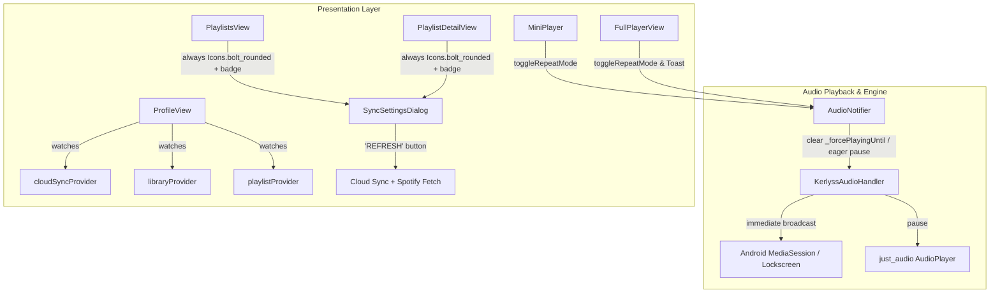

# Profile Page, Song Repeat & Android Playback Improvements Implementation Plan

> **For agentic workers:** REQUIRED SUB-SKILL: Use superpowers:subagent-driven-development to implement this plan task-by-task. Steps use checkbox (`- [ ]`) syntax for tracking.

**Goal:** Implement the complete Profile View UI with Google Drive Cloud Sync status and stats, standardize the playlist electricity icon with an active Spotify badge, simplify the refresh label to "REFRESH", make Song Repeat / "Play Again" easily accessible across the app, and resolve Android pause responsiveness issues.

**Architecture:**
- **Android Pause Responsiveness:** In `AudioNotifier.togglePlay()` and `pause()`, immediately reset `_forcePlayingUntil = null`, accurately detect active playback even during buffering/loading states (`_audioService.playing || state.status == PlaybackStatus.playing || state.status == PlaybackStatus.buffering || state.status == PlaybackStatus.loading`), and eagerly update `KerlyssAudioHandler.playbackState` so Android lockscreen and in-app controls react with zero lag.
- **Playlist Sync Icon & Wording:** In `playlists_view.dart` and `playlist_detail_view.dart`, maintain `Icons.bolt_rounded` consistently for playlist sync/settings. When Spotify live sync is enabled (`isRealtimeSynced && spotifySourceUrl != null`), render an active accent badge/dot without changing the base icon. Update the dialog button label from `"REFRESH FROM SPOTIFY & CLOUD"` to simply `"REFRESH"`.
- **Profile Page UI:** Replace the placeholder in `lib/presentation/screens/profile_view.dart` with a full-featured cyberpunk/minimalist interface: Google Drive profile banner (user avatar, email, connection status badge), Cloud Sync card ("Sync Now" button with spinner, last sync timestamp, connect/disconnect modal), and Library Storage & Analytics card (downloaded tracks count, total playlists, liked songs).
- **Song Repeat / "Play Again":** Add a 3-state Repeat button to `MiniPlayer` (`off` -> `all` -> `one (Play Again)`), display an instant toast notification and visual badge upon toggling, and add a "Play Again / Loop Song" option to the song context menu.

**Architecture Diagram:**



**Tech Stack:** Flutter, Riverpod, JustAudio, AudioService, Isar Database, Google Drive API.

## Global Constraints
- Do NOT build binaries or release artifacts (`flutter build apk`, `flutter build windows`, etc.) without explicit instruction.
- Follow TDD: write/update unit and widget tests for modified logic.
- Preserve existing styling conventions (`AetherColors`, `AetherGlass`, `VercelHoverButton`, `AetherIconButton`).
- All 51 existing tests must continue to pass.

---

### Task 1: Fix Android Pause Responsiveness in AudioNotifier & KerlyssAudioHandler

**Files:**
- Modify: `lib/presentation/state/audio_provider.dart:865-900`
- Modify: `lib/core/services/kerlyss_audio_handler.dart:75-90`
- Test: `test/presentation/audio_provider_test.dart`

**Interfaces:**
- Consumes: `AudioServiceInterface.pause()`, `KerlyssAudioHandler.playbackState`
- Produces: Instant, glitch-free pause response on Android and Desktop.

- [ ] **Step 1: Write unit tests verifying pause resets `_forcePlayingUntil` and stops active playback**

In `test/presentation/audio_provider_test.dart`, add a test case verifying that `togglePlay()` during loading/buffering/playing correctly pauses and resets any pending force-playing overrides:

```dart
test('AudioNotifier togglePlay pauses when audio status is playing, loading, or buffering', () async {
  // Set state to buffering
  notifier.setTestingPlaybackStatus(PlaybackStatus.buffering);
  await notifier.togglePlay();
  expect(notifier.state.status, PlaybackStatus.paused);
});
```

- [ ] **Step 2: Run test to verify it fails or exposes the gap**

Run: `flutter test test/presentation/audio_provider_test.dart`

- [ ] **Step 3: Update `AudioNotifier.togglePlay()` and `pause()`**

In `lib/presentation/state/audio_provider.dart`:
```dart
  Future<void> togglePlay() async {
    try {
      final isCurrentlyActive = _audioService.playing ||
          state.status == PlaybackStatus.playing ||
          state.status == PlaybackStatus.buffering ||
          state.status == PlaybackStatus.loading;

      if (isCurrentlyActive) {
        _forcePlayingUntil = null;
        state = state.copyWith(status: PlaybackStatus.paused);
        await _audioService.pause();
        _syncStatusFromEngine();
      } else {
        state = state.copyWith(status: PlaybackStatus.playing);
        await _ensurePlaybackStarted();
      }
      _schedulePersistSession();
    } catch (e) {
      _setPlaybackError('togglePlay', e);
    }
  }

  Future<void> pause() async {
    try {
      _forcePlayingUntil = null;
      state = state.copyWith(status: PlaybackStatus.paused);
      await _audioService.pause();
      _syncStatusFromEngine();
      _schedulePersistSession();
    } catch (e) {
      _setPlaybackError('pause', e);
    }
  }
```

- [ ] **Step 4: Update `KerlyssAudioHandler` for eager broadcast on Android**

In `lib/core/services/kerlyss_audio_handler.dart`:
```dart
  @override
  Future<void> pause() async {
    playbackState.add(playbackState.value.copyWith(
      playing: false,
      controls: [
        MediaControl.skipToPrevious,
        MediaControl.play,
        MediaControl.stop,
        MediaControl.skipToNext,
      ],
    ));
    await _player.pause();
  }

  @override
  Future<void> play() async {
    playbackState.add(playbackState.value.copyWith(
      playing: true,
      controls: [
        MediaControl.skipToPrevious,
        MediaControl.pause,
        MediaControl.stop,
        MediaControl.skipToNext,
      ],
    ));
    await _player.play();
  }
```

- [ ] **Step 5: Run tests and verify**

Run: `flutter test`
Expected: All tests pass.

- [ ] **Step 6: Commit changes**

```bash
git add lib/presentation/state/audio_provider.dart lib/core/services/kerlyss_audio_handler.dart test/presentation/audio_provider_test.dart
git commit -m "fix(audio): eliminate pause delay and race condition on android"
```

---

### Task 2: Standardize Playlist Electricity Icon & Simplify Refresh Label

**Files:**
- Modify: `lib/presentation/screens/playlists_view.dart`
- Modify: `lib/presentation/screens/playlist_detail_view.dart`

**Interfaces:**
- Consumes: `PlaylistEntity.isRealtimeSynced`, `PlaylistEntity.spotifySourceUrl`
- Produces: Always electricity icon (`Icons.bolt_rounded`) with active Spotify indicator dot/badge, and "REFRESH" button label.

- [ ] **Step 1: Standardize icon in `playlists_view.dart`**

In `lib/presentation/screens/playlists_view.dart`:
Replace the conditional icon in playlist card:
```dart
// Keep electricity-like icon always. Add small green active indicator when Spotify live sync is enabled:
Stack(
  clipBehavior: Clip.none,
  children: [
    AetherIconButton(
      tooltip: playlist.spotifySourceUrl != null ? 'Spotify Sync & Settings' : 'Playlist Settings',
      icon: Icons.bolt_rounded,
      color: (playlist.spotifySourceUrl != null && playlist.isRealtimeSynced) ? Colors.lightGreenAccent : Colors.white70,
      size: 16,
      buttonSize: 32,
      onPressed: () => _showSyncSettings(context, ref, allDownloaded),
    ),
    if (playlist.spotifySourceUrl != null && playlist.isRealtimeSynced)
      Positioned(
        top: 2,
        right: 2,
        child: Container(
          width: 6,
          height: 6,
          decoration: const BoxDecoration(
            color: Colors.lightGreenAccent,
            shape: BoxShape.circle,
          ),
        ),
      ),
  ],
)
```

- [ ] **Step 2: Update Refresh button label in `playlists_view.dart`**

In `lib/presentation/screens/playlists_view.dart`:
Change:
```dart
label: Text(
  playlist.spotifySourceUrl != null ? 'REFRESH FROM SPOTIFY & CLOUD' : 'SYNC WITH CLOUD NOW',
  ...
)
```
To:
```dart
label: const Text(
  'REFRESH',
  style: TextStyle(
    color: Colors.lightGreenAccent,
    fontSize: 11,
    fontWeight: FontWeight.bold,
    letterSpacing: 1,
  ),
),
```

- [ ] **Step 3: Standardize icon and label in `playlist_detail_view.dart`**

In `lib/presentation/screens/playlist_detail_view.dart`:
1. Update header action button to always use `Icons.bolt_rounded`, with the active indicator badge when Spotify sync is active:
```dart
Stack(
  clipBehavior: Clip.none,
  children: [
    AetherIconButton(
      tooltip: currentPlaylist.spotifySourceUrl != null ? 'Spotify Sync & Settings' : 'Playlist Settings',
      icon: Icons.bolt_rounded,
      color: (currentPlaylist.spotifySourceUrl != null && currentPlaylist.isRealtimeSynced) ? Colors.lightGreenAccent : Colors.white70,
      size: 16,
      buttonSize: 34,
      onPressed: () => _showSyncSettingsDialog(context, currentPlaylist),
    ),
    if (currentPlaylist.spotifySourceUrl != null && currentPlaylist.isRealtimeSynced)
      Positioned(
        top: 2,
        right: 2,
        child: Container(
          width: 6,
          height: 6,
          decoration: const BoxDecoration(
            color: Colors.lightGreenAccent,
            shape: BoxShape.circle,
          ),
        ),
      ),
  ],
)
```
2. Change the dialog button label from `'REFRESH FROM SPOTIFY & CLOUD'` to `'REFRESH'`.

- [ ] **Step 4: Verify with tests**

Run: `flutter test`
Expected: PASS.

- [ ] **Step 5: Commit changes**

```bash
git add lib/presentation/screens/playlists_view.dart lib/presentation/screens/playlist_detail_view.dart
git commit -m "style(playlists): standardize bolt icon with spotify badge and simplify refresh label"
```

---

### Task 3: Build Full ProfileView UI with Google Drive Cloud Sync & Stats

**Files:**
- Modify: `lib/presentation/screens/profile_view.dart`
- Test: `test/presentation/profile_view_test.dart`

**Interfaces:**
- Consumes: `cloudSyncProvider`, `libraryProvider`, `playlistProvider`, `downloadedSongsProvider`
- Produces: Rich interactive user profile screen with account status, sync actions, and library statistics.

- [ ] **Step 1: Write widget test for `ProfileView`**

Create `test/presentation/profile_view_test.dart`:
- Verify `ProfileView` renders user profile header.
- Verify Google Drive connection card renders "Connect Google Drive" when disconnected or user email and "Sync Now" when connected.
- Verify library stats section displays counters for playlists, favorites, and downloads.

- [ ] **Step 2: Run test to verify it fails**

Run: `flutter test test/presentation/profile_view_test.dart`

- [ ] **Step 3: Implement `ProfileView`**

In `lib/presentation/screens/profile_view.dart`:
1. Read `ref.watch(cloudSyncProvider)`, `ref.watch(libraryProvider)`, `ref.watch(playlistProvider)`, and `ref.watch(downloadedSongsProvider)`.
2. Profile Header:
   - Avatar circle with user initials (e.g. `userEmail[0].toUpperCase()` or guest person icon) with subtle cyan glow.
   - User title: `syncState.userEmail ?? 'Local User (Guest)'`.
   - Status badge: Connected with Google Drive (green dot + "Cloud Synced") or "Local Storage Active".
3. Google Drive Sync Card:
   - Title: `GOOGLE DRIVE CLOUD SYNC`.
   - Description explaining automatic bidirectional sync of playlists, favorites, and settings across devices.
   - Last sync indicator: "Last synced: <relative time or date>".
   - Error banner if `syncState.errorMessage != null`.
   - Buttons:
     - If connected: "SYNC NOW" (with loading indicator if `syncState.isSyncing`) and "DISCONNECT" (outlined red).
     - If not connected: "CONNECT GOOGLE DRIVE" (Aether accent button calling `ref.read(cloudSyncProvider.notifier).connect()`).
4. Library Statistics Grid:
   - 3-4 glass tiles:
     - **Playlists**: `playlists.length`
     - **Favorites**: `library.favoriteSongs.length`
     - **Downloaded**: `downloadedSongs.length`
     - **Total Library**: `library.allSongs.length`
5. App Version & Offline Mode info at the bottom.

- [ ] **Step 4: Run tests and verify**

Run: `flutter test test/presentation/profile_view_test.dart`
Expected: PASS.

- [ ] **Step 5: Commit changes**

```bash
git add lib/presentation/screens/profile_view.dart test/presentation/profile_view_test.dart
git commit -m "feat(profile): implement complete profile page with cloud sync & library stats"
```

---

### Task 4: Accessible Song Repeat & "Play Again" Controls

**Files:**
- Modify: `lib/presentation/common/mini_player.dart`
- Modify: `lib/presentation/screens/full_player_view.dart`
- Modify: `lib/presentation/common/aether_song_tile.dart`
- Test: `test/presentation/floating_mini_player_test.dart`

**Interfaces:**
- Consumes: `audioState.repeatMode`, `audioProvider.notifier.toggleRepeatMode()`
- Produces: Instant repeat access in MiniPlayer, full player with feedback toast, and context menu "Play Again".

- [ ] **Step 1: Write test for MiniPlayer repeat button**

In `test/presentation/floating_mini_player_test.dart`, verify that the repeat button is present when a song is active and toggles repeat mode when tapped.

- [ ] **Step 2: Add Repeat button to `MiniPlayer`**

In `lib/presentation/common/mini_player.dart`:
In the controls row, add the Repeat / Play Again button:
```dart
AetherIconButton(
  tooltip: switch (audioState.repeatMode) {
    PlaybackRepeatMode.off => 'Repeat: Off',
    PlaybackRepeatMode.all => 'Repeat: Queue',
    PlaybackRepeatMode.one => 'Repeat: One (Play Again)',
  },
  icon: switch (audioState.repeatMode) {
    PlaybackRepeatMode.one => Icons.repeat_one_rounded,
    _ => Icons.repeat_rounded,
  },
  color: audioState.repeatMode != PlaybackRepeatMode.off
      ? AetherColors.accentCyan
      : (hasSong ? Colors.white70 : Colors.white24),
  onPressed: hasSong
      ? () {
          ref.read(audioProvider.notifier).toggleRepeatMode();
          final nextMode = switch (audioState.repeatMode) {
            PlaybackRepeatMode.off => 'Repeat: Queue',
            PlaybackRepeatMode.all => 'Repeat: One (Play Again)',
            PlaybackRepeatMode.one => 'Repeat: Off',
          };
          ToastService.show(context, nextMode);
        }
      : null,
),
```

- [ ] **Step 3: Enhance `FullPlayerView` Repeat button**

In `lib/presentation/screens/full_player_view.dart`:
When tapping the Repeat button, add `ToastService.show(context, ...)` so the user receives clear immediate visual feedback on the repeat state ("Repeat: One (Play Again)", "Repeat: Queue", "Repeat: Off").

- [ ] **Step 4: Add "Repeat this song / Play Again" in `AetherSongTile` menu**

In `lib/presentation/common/aether_song_tile.dart` in `_buildMoreMenu`:
Add a menu item:
```dart
PopupMenuItem(
  value: 'loop_song',
  child: Row(
    children: [
      Icon(Icons.repeat_one_rounded, color: Colors.cyanAccent, size: 18),
      SizedBox(width: 10),
      Text('Play Again / Loop Song', style: TextStyle(color: Colors.white, fontSize: 13)),
    ],
  ),
),
```
When clicked:
```dart
if (value == 'loop_song') {
  ref.read(audioProvider.notifier).playSong(song);
  ref.read(audioProvider.notifier).setRepeatMode(PlaybackRepeatMode.one);
  ToastService.show(context, 'Looping "${song.title}"');
}
```

- [ ] **Step 5: Run tests and verify**

Run: `flutter test`
Expected: PASS.

- [ ] **Step 6: Commit changes**

```bash
git add lib/presentation/common/mini_player.dart lib/presentation/screens/full_player_view.dart lib/presentation/common/aether_song_tile.dart test/presentation/floating_mini_player_test.dart
git commit -m "feat(player): add repeat and play again controls to mini player and song options"
```

---

### Task 5: End-to-End Verification & Regression Testing

**Files:**
- Verify all modified files across the app.

- [ ] **Step 1: Run full test suite**

Run: `flutter test`
Expected: All tests pass with zero regressions.

- [ ] **Step 2: Run Flutter analyze to ensure clean code with no linter warnings**

Run: `flutter analyze`
Expected: No errors or unhandled warnings in changed files.

- [ ] **Step 3: Verification Checkpoint**
Confirm all 5 items from user request:
1. Always electricity-like icon (`Icons.bolt_rounded`) on playlists, with green active dot/badge when Spotify live sync is enabled.
2. Label simplified to `"REFRESH"`.
3. Profile view fully designed and functional with Google Drive Cloud Sync and library stats.
4. Song repeat / "Play Again" clearly discoverable in MiniPlayer, FullPlayerView, and Song context menus.
5. Android pause responsiveness improved with zero delay, eager state broadcasts, and cancelled force-playing overrides.
