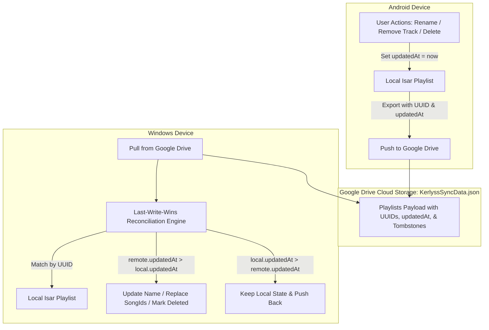

# Time-Tracked Bidirectional Cloud Sync Engine Implementation Plan

> **For agentic workers:** REQUIRED SUB-SKILL: Use superpowers:subagent-driven-development to implement this plan task-by-task. Steps use checkbox (`- [ ]`) syntax for tracking.

**Goal:** Implement a robust, time-tracked operation-based synchronization engine for Google Drive that uses immutable playlist UUIDs, precise `updatedAt` timestamps, and soft-delete tombstones to ensure renames, song additions/removals, and playlist deletions propagate deterministically across Android and Windows without duplicates or resurrection.

**Architecture:**
1. Every playlist receives an immutable RFC 4122 v4 `uuid`, a creation timestamp `createdAt`, a mutation timestamp `updatedAt`, and soft-delete flags (`isDeleted`, `deletedAt`).
2. When any user operation occurs (create, rename, add track, remove track, delete playlist), `updatedAt` is updated to the current UTC timestamp, and an eager cloud sync push is queued (1s debounce).
3. The Google Drive sync payload stores active playlists as well as soft-deleted tombstones with their `updatedAt` and `deletedAt`.
4. When syncing with Google Drive, the engine resolves conflicts using **Last-Write-Wins (LWW) per playlist**:
   - Matches playlists by `uuid` (falling back to canonical name binding for legacy un-synced playlists).
   - If `remote.updatedAt > local.updatedAt`: The remote operation is newer. The local playlist adopts remote `name` (renaming in place), remote `songIds` (cleanly removing deleted tracks without union resurrection), or marks as deleted if remote has a tombstone.
   - If `local.updatedAt > remote.updatedAt`: The local operation is newer. Local state is preserved and uploaded to Drive.

**Architecture Diagram:**



**Tech Stack:**
- Flutter / Dart 3.3+
- Isar Database 3.1.0+1
- Google Drive API v3
- Riverpod 2.5.1
- Mocktail for unit tests

## Global Constraints
- **NEVER** run release builds (`flutter build apk`, `flutter build windows`, etc.) without explicit instruction.
- **NEVER** modify `version.json` (must remain pinned to `1.3.0` for stable in-app update channel).
- All 63 existing automated tests must continue to pass.

---

### Task 1: Add `updatedAt`, `isDeleted`, and `deletedAt` to `PlaylistModel` and `PlaylistEntity`

**Files:**
- Modify: `lib/data/models/playlist_model.dart`
- Modify: `lib/domain/entities/playlist_entity.dart`
- Modify: `lib/data/models/playlist_model.g.dart` (generated via `build_runner`)
- Test: `test/data/playlist_model_mapping_test.dart`

- [x] **Step 1: Update `PlaylistEntity`**
- [x] **Step 2: Update `PlaylistModel` schema**
- [x] **Step 3: Regenerate Isar Schema with build_runner**
- [x] **Step 4: Update Unit Tests in `test/data/playlist_model_mapping_test.dart`**
- [x] **Step 5: Run tests and verify**

---

### Task 2: Update `IsarDatabaseService` & `PlaylistRepositoryImpl` to Support Soft-Delete

**Files:**
- Modify: `lib/data/datasources/local/isar_database_service.dart`
- Modify: `lib/data/repositories/playlist_repository_impl.dart`

- [x] **Step 1: Update `IsarDatabaseService` with soft-delete filtering & methods**
- [x] **Step 2: Update `PlaylistRepositoryImpl` with soft-delete and timestamps**
- [x] **Step 3: Run existing playlist tests**

---

### Task 3: Update `PlaylistNotifier` with Eager Timestamps and 1-Second Sync Debounce

**Files:**
- Modify: `lib/presentation/state/playlist_provider.dart`
- Modify: `lib/core/services/google_drive_sync_service.dart`

- [x] **Step 1: Update `PlaylistNotifier` methods with `updatedAt: DateTime.now().toUtc()`**
- [x] **Step 2: Reduce debounce to 1s in `GoogleDriveSyncService`**
- [x] **Step 3: Verify build compiles and tests pass**

---

### Task 4: Implement Time-Tracked LWW Sync & Tombstone Reconciliation in `GoogleDriveSyncService`

**Files:**
- Modify: `lib/core/services/google_drive_sync_service.dart`

- [x] **Step 1: Implement reconciliation logic in `_mergeRemoteData`**
- [x] **Step 2: Update `_exportLocalData` to export `updatedAt`, `isDeleted`, and `deletedAt` for all playlists including tombstones**
- [x] **Step 3: Run existing tests to ensure no regressions**

---

### Task 5: End-to-End Unit & Integration Tests

**Files:**
- Modify: `test/core/playlist_uuid_sync_test.dart`

- [x] **Step 1: Write comprehensive test cases in `test/core/playlist_uuid_sync_test.dart`**
- [x] **Step 2: Run targeted tests**
- [x] **Step 3: Run full test suite (`flutter test`)**

---

## Verification Plan

### Automated Tests
Run:
```bash
flutter test test/core/playlist_uuid_sync_test.dart
flutter test
```
All tests must pass without any warnings or failures.

### Manual Verification Flow
1. On Android: Create playlist "Test" with 6 songs.
2. Verify cloud sync pushes `{ uuid: U1, name: "Test", songIds: 6, updatedAt: t0 }`.
3. On Windows: Sync with cloud. Verify "Test" appears with 6 songs and same UUID.
4. On Android: Rename "Test" to "Test1". Remove 1 song (now 5 songs).
5. On Windows: Click "Refresh".
6. Verify on Windows:
   - Playlist is renamed to "Test1".
   - No duplicate "Test" playlist exists.
   - Exactly 5 songs are in "Test1" (the removed song is gone).
7. On Windows: Delete "Test1".
8. On Android: Click "Refresh".
9. Verify on Android: "Test1" is removed and does not reappear.
